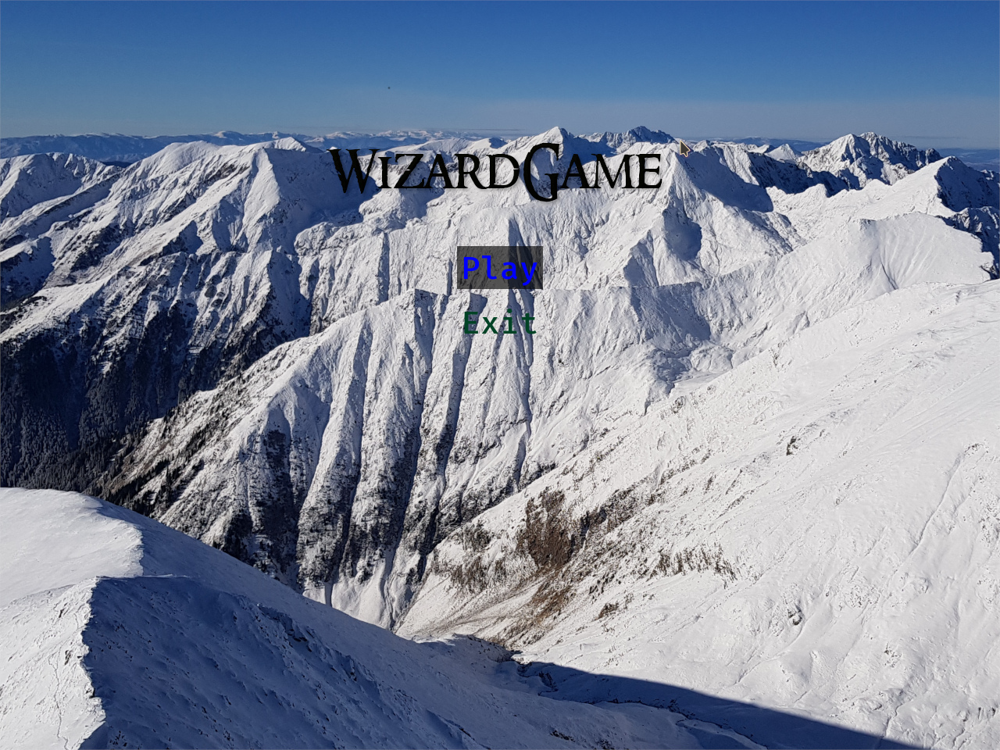

# WizardGame

This repository contains source code and assets for WizardGame, my project for
my university Object Oriented Programming course.

## Licensing

For assets, see the [README](resources/README.md) in the resources folder.

For the report, screenshots are subject to the licensing of the assets included
in them, with the note that they are a derivative work with game elements
placed atop the original resource. The text itself is licensed under CC-BY-SA 4.0.

The source code of the game is licensed under the [EUPL](./LICENSE.txt).
